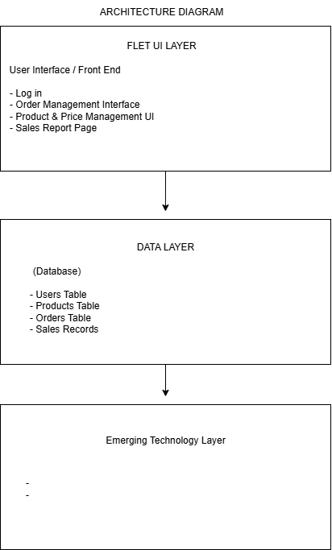

# FINAL PROJECT - TEAM COFFEESTRY

### COURSE: APPLICATION DEVELOPMENT AND EMERGING TECHNOLOGIES (CCCS 106)
Joint Collaboration: CS 3110 – Software Engineering (Team Process & Engineering Practices)\
Project Title: Emerging Tech Flet Framework\
Assessment Type: Project & Final Examination \
Term: AY 2025–2026 (Finals)


## Student Information
- **Name**: Jasmin Francisco
- **Student ID**: 231004627
- **Course**: CCCS 106
- **Section**: BSCS 3B

#
- **Name**: Jenny Ibarrientos
- **Student ID**: 23100
- **Course**: CCCS 106
- **Section**: BSCS 3B
#
- **Name**: Janice Laceda
- **Student ID**: 23100
- **Course**: CCCS 106
- **Section**: BSCS 3B

#
### Project Overview and Problem Statement
The Coffeestry System is a digital management application designed for coffee and pastry shop owners. Many small business owners face difficulties in managing orders, tracking products, and maintaining accurate pricing and sales records. Traditional manual methods of record-keeping are often inefficient, time-consuming, and prone to errors, making it challenging to access information quickly or make informed business decisions.

 The Coffeestry System provides a centralized digital database that securely stores important business information. It includes features for order management, allowing staff to process customer orders efficiently, and product and price management, ensuring that all menu items and prices are up-to-date. By digitizing these processes, Coffeestry helps business owners streamline operations, reduce errors, and save time, ultimately improving overall business efficiency and decision-making.

#

### Feature List & Scope Table (what’s in/out)
This is a list of all of the functions that Coffeestry system have:

USER AUTHENTICATION

[/] User Login / Authentication\
[/] Login Button\
[/] Logout Button\
[/] Sign Up (Staff)

USER & ACCESS MANAGEMENT

[/] Manage Users\
[/] Create/Manage Admin Accounts

PLATFORM OVERVIEW & ANALYTICS

[/] Dashboard (Platform Overview)\
[/] Platform Analytics

ORDER MANAGEMENT

[/] Create/Add Orders (Order Entry)\
[/] Update/Edit Orders\
[/] Delete Orders\
[/] View Order History\
[/] Generate Receipt/Order Details

PRODUCT & PRICE MANAGEMENT

[/] Product Management\
[/] Add New Products\
[/] Update Product Details\
[/] Delete Products\
[/] Price Management\
[/] Update Product Prices\
[/] View Price List

CUSTOMER & LOYALTY MANAGEMENT

[/] My Customers (Loyalty Account Creation)\
[/] Customer Orders (Loyalty Order Management)

ROLE-BASED FUNCTION BREAKDOWN

[/] SUPERADMIN

- Full System Access 
- Responsible for Platform Analytics, User Management, Admin Account Creation

[/] ADMIN
- Operational Dashboard
- Responsible for Order Management, Product/Price Management, Customer Loyalty Management

[/] CUSTOMER
- External
- Responsible for Signup, Placing Orders.


#

### Architecture Diagram (simple block diagram is fine; include Flet + data + emerging tech layer)
(wil change pa this)



FLET LAYER
(User Interface/Frontend)

- Login Screen
- Order Management Interface
- Product and Price Management
- on process to add more

DATA LAYER
(database part)

- Users Table
- Products Table
- Orders Table
- will add more

EMERGING TECHNOLOGY LAYER

- 

#
### Data Model (ERD or JSON schema overview)
[Users]
- user_id 
- username
- password
- role

[Products]
- product_id
- product_name
- category
- 

[Orders]
- order_id
- user_id
- order_date
- total_amount

[Order_Items]
- item_id
- order_id
- product_Id
- quantity
- subtotal

[Sales]
- sales_id
- order_id
- date
- amount

#
### Emerging Tech Explanation (why chosen, how integrated, limitations)
- AI-assisted feature (e.g., text summary, categorization, simple rule-based or lightweight model inference; if using external APIs ensure fallback handling.) - Automatic Product Categorization - automatically categorizes a new product based of the name that will be inputted. (JUST AN INITIAL PLAN)

# 
### Testing Summary (how to run, coverage notes)

#
### Team Roles & Contribution Matrix
- Jasmin Francisco: - Product Lead, Vision & Feature Prioritization, 
UI/UX & Accessibility Designer, 
Lead Developer (Flet Architecture), 
Documentation & Release Manager

- Jenny Ibarrientos -
- Janice Laceda -

#
### Risk / Constraint Notes & Future Enhancements


#
### Individual Reflection (per member: 150–200 words)
 - Jasmin Francisco
 - Jenny Ibarrientos
 - Janice Laceda


#
### Setup & Run Instructions (including dependency install and platform targets)
```bash
# Clone the repository
git clone https://github.com/<jasscs>Final-Project.git
cd FINAL

# Create virtual environment
python -m venv venv
source venv/bin/activate  # On Windows: venv\Scripts\activate

# Install dependencies
pip install -r requirements.txt

# Create .env file .env

# Add your Op
